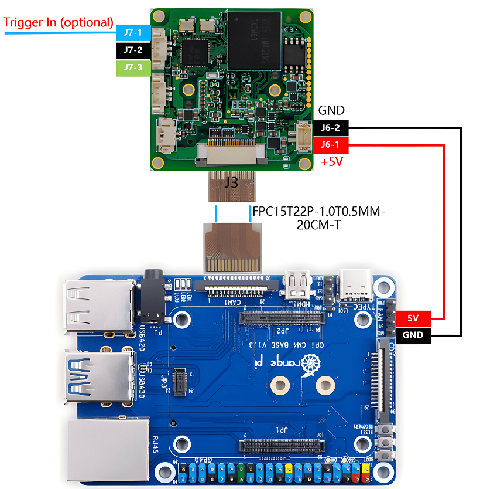
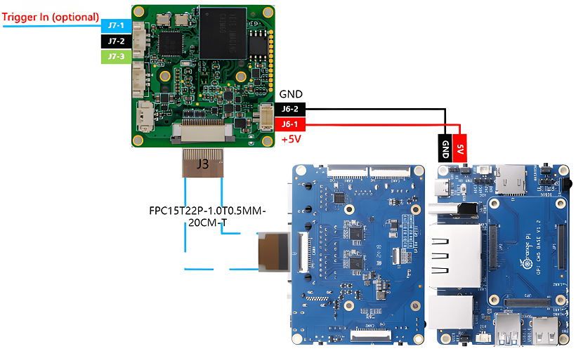
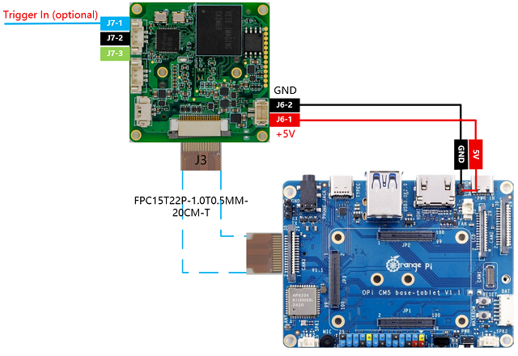

# How to use GX series cameras on OrangePi's RK35XX board
This is a mirror of [our wiki article](https://wiki.veye.cc/index.php/MV_Camera_on_Orange_Pi%27s_RK35XX_Boards).

[toc]

## Overview
The GX series cameras are cameras designed for AI applications in the industrial field. They use the MIPI CSI-2 interface and are particularly suitable for use with embedded computing platforms. They have rich data formats and triggering features, extremely low latency, high bandwidth, and reliable stability.

This article takes OrangePi CM4 and OrangePi CM5 and CM5 tablet board as an example to introduce how to connect GX series cameras to the RK3566/3K3568 and RK3588S/RK3588 system.

We provide drivers for the Linux operating system (using Ubuntu as an example).

### Camera Module List

| Series  | Model  | Status  |
| ------------ | ------------ | ------------ |
| GX series	 | GX-MIPI-IMX662	| Done  |
## Hardware Setup
We use the official baseboards of the Orange Pi CM4 and CM5, which feature a 15-pin header compatible with Raspberry Pi. For the GX series cameras, our cameras can be directly mounted onto the baseboard without the need for an adapter board.
### Camera Connection to Orange Pi CM4
The ADP-MV1 is connected to the OrangePi CM4 via a 15-pin FFC cable with opposite surface alignment; please pay attention to the orientation of the contact surfaces.

Note that only the CAM1 shown in the image below supports GX cameras.

### Camera Connection to Orange Pi CM5
The OrangePi CM5 supports up to four cameras. The following diagram shows the hardware connection method for simultaneously connecting multiple cameras.



### Camera Connection to Orange Pi CM5 tablet
Due to differences in connector formats, we have successfully interfaced modules for both CAM2 and CAM3 on the OrangePi CM5 tablet. The diagram below illustrates the connection methods for the GX series.


## Introduction to github repositories

https://github.com/veyeimaging/rk35xx_orangepi

includes:
- driver source code
- i2c toolkits
- application demo

In addition, a compiled linux kernel installation package is provided in the [releases](https://github.com/veyeimaging/rk35xx_orangepi/releases).
## Upgrade the Ubuntu system
We provide a flashing image for the release system, as well as a deb package for the Linux kernel.

Refer to the [OrangePi CM4 user manual](http://www.orangepi.org/orangepiwiki/index.php/Orange_Pi_CM4) or the [OrangePi CM5 user manual](http://www.orangepi.org/html/hardWare/computerAndMicrocontrollers/service-and-support/Orange-Pi-CM5.html) for instructions on flashing the system. Alternatively, you can use the general dpkg command to install the deb package.
## Check system status
Run the following command to confirm whether the camera is probed.
```
sudo dmesg | grep gxcam
```
### CM4

The CM4 supports camera connection only through the CAM1 interface. Taking the GX-MIPI-IMX662 as an example, the dmesg output contains the following information:

The output message appears as shown below：
```
gxcam 1-003b: camera is: GX-MIPI-IMX662

gxcam 1-003b: firmware version: 0x1040000
```
- Run the following command to check the presence of video node.
```
ls /dev/video0
```
The output message appears as shown below.
```
video0
```
### CM5
The CM5 supports the connection of up to four cameras. Taking the GX-MIPI-IMX662 as an example, the dmesg output contains the following information:
```
gxcam 3-003b: camera is: GX-MIPI-IMX662

gxcam 3-003b: firmware version: 0x1040000

gxcam 4-003b: camera is: GX-MIPI-IMX662

gxcam 4-003b: firmware version: 0x1040000

gxcam 5-003b: camera is: GX-MIPI-IMX662

gxcam 5-003b: firmware version: 0x1040000  

gxcam 6-003b: camera is: GX-MIPI-IMX662

gxcam 6-003b: firmware version: 0x1040000
```
### CM5 tablet
The CM5 supports the connection of up to two cameras. Taking the GX-MIPI-IMX662 as an example, the dmesg output contains the following information:

```
gxcam 6-003b: camera is: GX-MIPI-IMX662

gxcam 6-003b: firmware version: 0x1040000

gxcam 7-003b: camera is: GX-MIPI-IMX662

gxcam 7-003b: firmware version: 0x1040000
```

## Camera Application Development Guide
[Application Development Guide](https://wiki.veye.cc/index.php/GX_Camera_Application_Development_Guide)

## References
- OrangePi CM4

[http://www.orangepi.cn/orangepiwiki/index.php/Orange_Pi_CM4](http://www.orangepi.cn/orangepiwiki/index.php/Orange_Pi_CM4)

- OrangePi CM5

[http://www.orangepi.cn/html/hardWare/computerAndMicrocontrollers/service-and-support/Orange-Pi-CM5.html](http://www.orangepi.cn/html/hardWare/computerAndMicrocontrollers/service-and-support/Orange-Pi-CM5.html)
## Document History
- 2025-12-29

Release 1st version.