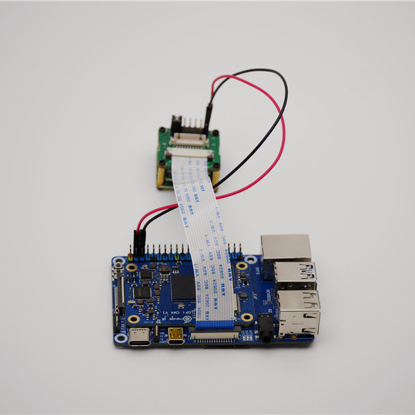
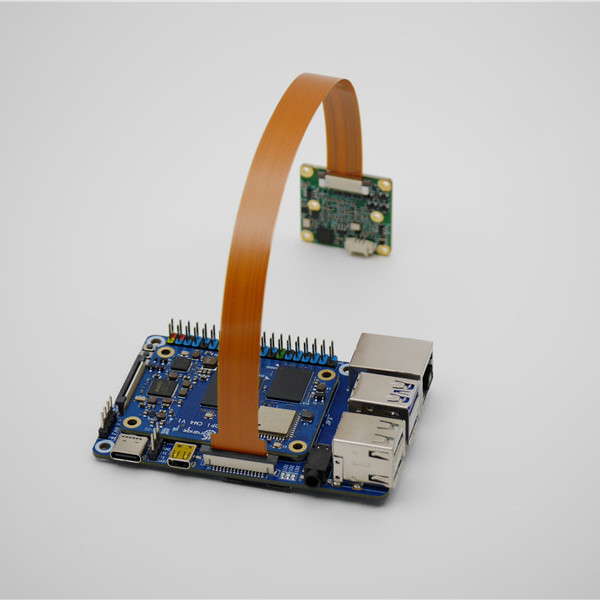
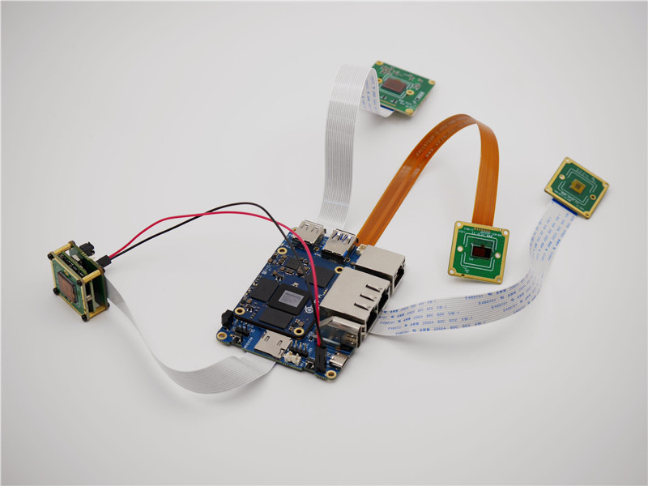
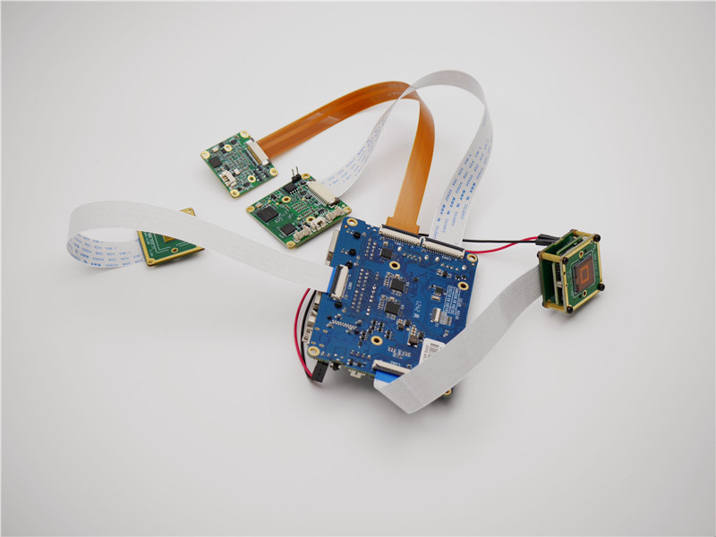
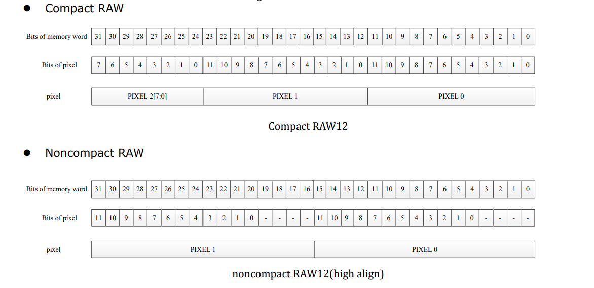

# How to use MV and RAW series cameras on OrangePi's RK35XX Boards
This is a mirror of [our wiki article](https://wiki.veye.cc/index.php/MV_Camera_on_Orange_Pi%27s_RK35XX_Boards).

[toc]

## Overview
The MV series and RAW series cameras are cameras designed for AI applications in the industrial field. They use the MIPI CSI-2 interface and are particularly suitable for use with embedded computing platforms. They have rich data formats and triggering features, extremely low latency, high bandwidth, and reliable stability.

This article takes OrangePi CM4 and OrangePi CM5 board as an example to introduce how to connect MV and RAW series cameras to the RK3566/3K3568 and RK3588S/RK3588 system.

We provide drivers for the Linux operating system (using Ubuntu as an example).

### Camera Module List

| Series  | Model  | Status  |
| ------------ | ------------ | ------------ |
| MV Series  | MV-MIPI-IMX178M  | Done  |
| MV Series  | MV-MIPI-IMX130M  | Done  |
| MV Series  | MV-MIPI-IMX296M  | Done  |
| MV Series  | MV-MIPI-IMX287M  | Done  |
| MV Series  | MV-MIPI-IMX265M  | Done  |
| MV Series  | MV-MIPI-IMX264M  | Done  |
| RAW Series  | RAW-MIPI-SC132M  | Done  |
| RAW Series  | RAW-MIPI-AR0234M  | Done  |
| RAW Series  | RAW-MIPI-IMX462M  | Done  |
| RAW Series  | RAW-MIPI-SC535M  | Done  |

## Hardware Setup
We use the official baseboards of the Orange Pi CM4 and CM5, which feature a 15-pin header compatible with Raspberry Pi. For the RAW series cameras, our cameras can be directly mounted onto the baseboard without the need for an adapter board. For the MV series cameras, the ADP-MV1 adapter board is required for connection.

### Camera Connection to Orange Pi CM4
The ADP-MV1 is connected to the OrangePi CM4 via a 15-pin FFC cable with opposite surface alignment; please pay attention to the orientation of the contact surfaces.
Note that only the CAM1 shown in the image below supports MV and RAW cameras.





### Camera Connection to Orange Pi CM5
The OrangePi CM5 supports up to four cameras. The following diagram shows the hardware connection method for simultaneously connecting multiple cameras.





## Introduction to github repositories

https://github.com/veyeimaging/rk35xx_veye_bsp
https://github.com/veyeimaging/rk35xx_orangepi

includes：
- driver source code
- i2c toolkits
- application demo
In addition, a compiled linux kernel installation package is provided in the releases.[releases](https://github.com/veyeimaging/rk35xx_orangepi/releases).

## Upgrade the Ubuntu system

We provide a flashing image for the release system, as well as a deb package for the Linux kernel.

Refer to the [OrangePi CM4 user manual](http://www.orangepi.org/orangepiwiki/index.php/Orange_Pi_CM4) or the [OrangePi CM5 user manual](http://www.orangepi.org/html/hardWare/computerAndMicrocontrollers/service-and-support/Orange-Pi-CM5.html) for instructions on flashing the system. Alternatively, you can use the general dpkg command to install the deb package.

## Check system status
After system update, reboot the main board.
Run the following command to confirm whether the camera is probed.
```bash
sudo dmesg | grep mvcam
```
### CM4
The CM4 supports camera connection only through the CAM1 interface. Taking the RAW-MIPI-SC132M as an example, the dmesg output contains the following information:

The output message appears as shown below:
```bash
mvcam 1-003b: camera is: RAW-MIPI-SC132M
mvcam 1-003b: firmware version: 0x1040000
```
- Check the video0 device node:
```
ls /dev/video0
```
You should see:
```
video0
```
After successfully identifying the camera, the camera will be recognized as /dev/video0.
### CM5
The CM5 supports the connection of up to four cameras. Taking the RAW-MIPI-SC132M as an example, the dmesg output contains the following information:
```bash
mvcam 3-003b: camera is: RAW-MIPI-SC132M
mvcam 3-003b: firmware version: 0x1040000
mvcam 4-003b: camera is: RAW-MIPI-SC132M
mvcam 4-003b: firmware version: 0x1040000
mvcam 5-003b: camera is: RAW-MIPI-SC132M
mvcam 5-003b: firmware version: 0x1040000  
mvcam 6-003b: camera is: RAW-MIPI-SC132M
mvcam 6-003b: firmware version: 0x1040000
```

### Viewing the Topology with media-ctl

Let's take CM5's CAM1 as an example for explanation.

By using the media-ctl command, you can clearly display the current topology.
```bash
media-ctl -p -d /dev/media2
```

#### Link relationship
mv camera->rockchip-csi2-dphy1->rockchip-mipi-csi2->stream_cif_mipi_id0 - - ->DDR(`/dev/video22`)

The application can obtain images through the `/dev/video22` node.

#### mv camera entity information

Taking the RAW-MIPI-SC132M as an example:
```
- entity 63: m00_b_mvcam 4-003b (1 pad, 1 link)

             type V4L2 subdev subtype Sensor flags 0

             device node name /dev/v4l-subdev8

        pad0: Source

                [fmt:Y8_1X8/1080x1280@100/12000 field:none]

                -> "rockchip-csi2-dphy1":0 [ENABLED]
```

You can see that:

- The complete name of this entity is: `m00_b_mvcam 4-003b`.
- It is a V4L2 subdev (Sub-Device) Sensor.
- Its corresponding node is `/dev/v4l-subdev8`, which can be opened and - configured by applications (such as `v4l2-ctl`).
- Its output format is `[fmt:Y8_1X8/1080x1280@100/12000 field:none]`, where - `Y8_1X8` is a shorthand for a mbus-code, which will be listed in the next section of this article.
- The current resolution is `1080x1280`.
- The current frame interval is `100/12000`, which means the frame rate is 120.
- The data format output by the camera can be modified using the media-ctl command.

The correspondence of the various information is as follows:

- CM4
| CAM num | I2C | media node  | media entity name      | video node    | subdev node      |
|---------|-----|-------------|------------------------|---------------|------------------|
| 1       | 1   | /dev/media0 | m00_b_mvcam 1-003b     | /dev/video0   | /dev/v4l-subdev2 |

- CM5 
| CAM num | I2C | media node  | media entity name      | video node    | subdev node      |
|---------|-----|-------------|------------------------|---------------|------------------|
| 1       | 4   | /dev/media2 | m00_b_mvcam 4-003b     | /dev/video22  | /dev/v4l-subdev8 |
| 2       | 3   | /dev/media3 | m01_b_mvcam 3-003b     | /dev/video33  | /dev/v4l-subdev11|
| 3       | 5   | /dev/media1 | m00_b_mvcam 5-003b     | /dev/video11  | /dev/v4l-subdev5 |
| 4       | 6   | /dev/media0 | m00_b_mvcam 6-003b     | /dev/video0   | /dev/v4l-subdev2 |

#### mbus-code list
MV series and RAW series cameras have different data format capabilities, which can be found in the data manual for each camera model.
| Format on datasheet  | mbus-code for media-ctl  | pixelformat for v4l2-ctl  |
| ------------ | ------------ | ------------ |
| RAW8	| Y8_1X8 |	GREY | 
| RAW10	| Y10_1X10 |	'Y10 ' | 
| RAW12	| Y12_1X12 |	'Y12 ' | 
| UYVY	| UYVY8_2X8 |	UYVY | 

## Raw data format
The VICAP module of RK3588 supports two data saving formats, Compact and Noncompact RAW. You can modify the mode using the RKCIF_CMD_SET_CSI_MEMORY_MODE ioctl command of RKCIF. By default, the output is in Compact RAW format.


### Noncompact RAW
For pixel data with 10-bit depth or 12-bit depth, two bytes are always used to store one pixel. This storage method is convenient for software processing, but it has the disadvantage of occupying a large amount of space.

Depending on whether the effective data is stored in the high bits or low bits, it can be further divided into two types: high align and low align.

#### Noncompact RAW(high align)
Data is saved to the high bits, and the unused low bits are filled with 0. This is one of the data formats supported by RK VICAP.

#### Noncompact RAW(low align)
In Noncompact RAW (low align) format, data is saved to the low bits, and the unused high bits are filled with 0. The V4L2 standard 'Y10' (10-bit Greyscale) and 'Y12' (12-bit Greyscale) formats are both stored in this way.

The pixel_layer_convert conversion tool mentioned later in the article also converts Compact RAW to this storage format for easy display using image players.

### Compact RAW
As shown above，there is no bit padding between pixels in this storage format.

### Line stride
To facilitate fast operations on images, the system usually provides row-aligned buffer sizes for each line of data. RK3588 uses 256-byte alignment for this purpose.

line_stride = ALIGN_UP（image_width*bits_per_pixel/8,256）

For example, when the image width is 1456:

8bit depth，line_stride=1536

10bit depth，preferred_stride=2048

12bit depth，preferred_stride=2304

### Format convert tool
We have written a small tool: pixel_layer_convert, which can easily convert Compact images to Noncompact (low align) images.

For example, the following command can convert a Compact RAW10 image with a width of 1456 to Noncompact RAW10 format:
```
./pixel_layer_convert -I R10C -i y10-1456x1088_0001.raw -o y10-1456x1088_0001_new.raw -w 1456
```
### Raw data image player
We recommend using [vooya](https://www.offminor.de/) as the player, which supports GREY, and unpacked image formats.

Also, y8 file can be used with this player: [YUV Displayer Deluxe](https://yuv-player-deluxe.software.informer.com/2.6/).

## Application examples
Please note that in the following sections, `/dev/media0`, `/dev/video0`, and `/dev/v4l-subdev2` should be replaced with the actual values as described in the previous sections.
###  Configuring  global variables
Based on the board model, configure the I2C_BUS global variable as follows:

- OrangePi CM4
```
export I2C_BUS=1
```
- OrangePi CM5
```
export I2C_BUS=6
```

For the convenience of later descriptions, global variables are configured here according to the sensor size.
- MV-MIPI-IMX178M
```
export WIDTH=3088
export HEIGHT=2064
export FPS=22
```
- MV-MIPI-SC130M
```
export WIDTH=1280
export HEIGHT=1024
export FPS=108
```
- MV-MIPI-IMX296M
```
export WIDTH=1456
export HEIGHT=1088
export FPS=60
```
- MV-MIPI-IMX287M
```
export WIDTH=704
export HEIGHT=544
export FPS=319
```

- MV-MIPI-IMX265M
```
export WIDTH=2048
export HEIGHT=1544
export FPS=45
```
- MV-MIPI-IMX264M
```
export WIDTH=2432
export HEIGHT=2056
export FPS=28
```
- RAW-MIPI-SC132M
```
export WIDTH=1080
export HEIGHT=1280
export FPS=120
```
- RAW-MIPI-SC535M
```
export WIDTH=2432
export HEIGHT=2048
export FPS=100
```

### Configure parameters using v4l2-ctl
$ v4l2-ctl -d /dev/v4l-subdev2 -L
```
User Controls

                   trigger_mode 0x00981901 (int)    : min=0 max=2 step=1 default=0 value=0 flags=volatile, execute-on-write

                    trigger_src 0x00981902 (int)    : min=0 max=1 step=1 default=1 value=1 flags=volatile, execute-on-write

                    soft_trgone 0x00981903 (button) : flags=write-only, execute-on-write

                     frame_rate 0x00981904 (int)    : min=1 max=60 step=1 default=60 value=60 flags=volatile, execute-on-write

                          roi_x 0x00981905 (int)    : min=0 max=1376 step=8 default=0 value=0

                          roi_y 0x00981906 (int)    : min=0 max=1024 step=4 default=0 value=0
```

Parameters can be set and get using the following methods.
```
v4l2-ctl --set-ctrl [ctrl_type]=[val]
v4l2-ctl --get-ctrl [ctrl_type]
```
All the above functions can be implemented using [mv_mipi_i2c.sh](http://wiki.veye.cc/index.php/Mv_mipi_i2c.sh_user_guide).

Note that the above parameters cannot be modified during the capture process.

The following is an explanation of each parameter:

#### Trigger Mode
`v4l2-ctl --set-ctrl trigger_mode=[0-2]`
0: Video streaming mode
1: Normal trigger mode.
2: High-speed continuous trigger mode.

#### Trigger Source
`v4l2-ctl --set-ctrl trigger_src=[0-1]`

0: Software trigger mode.
1: Hardware trigger mode.

#### Software trigger command
`v4l2-ctl --set-ctrl soft_trgone=1`

#### Set frame rate
`v4l2-ctl --set-ctrl frame_rate=[1-max]`
The maximum frame rate is automatically updated as the resolution changed.

#### Set the starting position of the ROI
```
v4l2-ctl -d /dev/v4l-subdev2 --set-ctrl roi_x=0
v4l2-ctl -d /dev/v4l-subdev2 --set-ctrl roi_y=0
```
After setting the ROI starting position, you need to complete the full ROI configuration using the media-ctl command.

Note that setting the ROI may affect the maximum frame rate, and the ROI parameters need to meet the requirements specified in the camera manual.

### Set image format using media-ctl
use the following command to configure the camera's data format, resolution, and frame rate using media-ctl:
```
media-ctl -d /dev/media0 --set-v4l2 '"m00_b_mvcam '"$I2C_BUS"'-003b":0[fmt:Y8_1X8/'"$WIDTH"'x'"$HEIGHT"'@1/'"$FPS"']'
```
Among them: `"m00_b_mvcam '"$I2C_BUS"'-003b"` refers to the complete name of the camera entity, `Y8_1X8` is the mbus-code, `'"$WIDTH"'x'"$HEIGHT"'` indicates the resolution, `1/'"$FPS"'` indicates the resolution frame rate.

The width and height here cooperate with the `roi_x` and `roi_y` of the v4l2-ctl command to form the ROI parameter.

For example, for MV-MIPI-IMX296M, the command after variable replacement would be:
```
media-ctl -d /dev/media0 --set-v4l2 '"m00_b_mvcam 7-003b":0[fmt:Y8_1X8/1456x1088@1/60 field:none]'
```
You can not only configure the data format, resolution, and frame rate in one command, but also modify them separately as needed.

###  Video Streaming mode
#### Set data format, resolution, frame rate
```
v4l2-ctl -d /dev/v4l-subdev2 --set-ctrl roi_x=0
v4l2-ctl -d /dev/v4l-subdev2 --set-ctrl roi_y=0
media-ctl -d /dev/media0 --set-v4l2 '"m00_b_mvcam '"$I2C_BUS"'-003b":0[fmt:Y8_1X8/'"$WIDTH"'x'"$HEIGHT"'@1/'"$FPS"']'
```
#### Frame rate statistics
In streaming mode, the following commands can be used for frame rate statistics：
```
v4l2-ctl --set-fmt-video=width=$WIDTH,height=$HEIGHT,pixelformat=GREY --stream-mmap --stream-count=-1 --stream-to=/dev/null
```
#### Save image to file
- raw8
```
v4l2-ctl -d /dev/video0 --set-fmt-video=width=$WIDTH,height=$HEIGHT,pixelformat=GREY --stream-mmap --stream-count=1 --stream-to=y8-$WIDTHx$HEIGHT.raw
```
- raw10
```
v4l2-ctl -d /dev/video0 --set-fmt-video=width=$WIDTH,height=$HEIGHT,pixelformat='Y10 ' --stream-mmap --stream-count=1 --stream-to=y10-$WIDTHx$HEIGHT.raw
```
- raw12
```
v4l2-ctl -d /dev/video0 --set-fmt-video=$WIDTH,height=$HEIGHT,pixelformat='Y12 ' --stream-mmap --stream-count=1 --stream-to=y12-$WIDTHx$HEIGHT.raw
```
Please refer to the description in the previous section for the image format.

#### Example of yavta
##### Install yavta
```
git clone git://git.ideasonboard.org/yavta.git
cd yavta;make
```
##### Save image to file
After setting data format, resolution, frame rate，run:
```
./yavta -c1 -Fy8-${WIDTH}x${HEIGHT}.raw --skip 0 -f Y8 -s ${WIDTH}x${HEIGHT} /dev/video0
```
#### Example of import image to OpenCV
See the [samples](https://github.com/veyeimaging/rk35xx_veye_bsp/tree/main/samples) directory on github for details.
```
./v4l2dev_2_opencv_show_grey.py --width 1456 --height 1088 --fps 60 --i2c 7
```
#### Example of gstreamer application
To facilitate installation and debugging, the MV series cameras provide UYVY mode, which supports a maximum width of 2880 and can be previewed in real time using the following command.

Note that the RAW series does not support the UYVY format.

Note: To increase the maximum frame rate and bandwidth, some modules no longer support the UYVY format. Please use the "fmtcap" command in the script to read the registers to confirm the specific configuration.

We provide several gstreamer routines that implement the preview function. See the [samples](https://github.com/veyeimaging/rk35xx_veye_bsp/tree/main/samples) directory on github for details.

### Trigger mode
#### Set data format, resolution, frame rate
```
v4l2-ctl -d /dev/v4l-subdev2 --set-ctrl roi_x=0
v4l2-ctl -d /dev/v4l-subdev2 --set-ctrl roi_y=0
media-ctl -d /dev/media0 --set-v4l2 '"m00_b_mvcam '"$I2C_BUS"'-003b":0[fmt:Y8_1X8/'"$WIDTH"'x'"$HEIGHT"'@1/'"$FPS"']'
```
#### Software trigger mode
##### Set mode
```
v4l2-ctl -d /dev/v4l-subdev2 --set-ctrl trigger_mode=1
v4l2-ctl -d /dev/v4l-subdev2 --set-ctrl trigger_src=0
```
##### Start acquisition
```
v4l2-ctl -d /dev/video0 --set-fmt-video=width=$WIDTH,height=$HEIGHT,pixelformat=GREY --stream-mmap --stream-count=1 --stream-to=y8-$WIDTHx$HEIGHT.raw
```
##### Perform soft trigger operation
In other shell terminals, you can execute the following command multiple times for multiple triggers.
```
v4l2-ctl -d /dev/v4l-subdev2 --set-ctrl soft_trgone=1
```
#### Hardware trigger mode
##### Set mode
```
v4l2-ctl -d /dev/v4l-subdev2 --set-ctrl trigger_mode=1
v4l2-ctl -d /dev/v4l-subdev2 --set-ctrl trigger_src=1
```
The mv_mipi_i2c.sh script can be used to set rich trigger parameters.
##### Start acquisition
```
v4l2-ctl -d /dev/video0 --set-fmt-video=width=$WIDTH,height=$HEIGHT,pixelformat=GREY --stream-mmap --stream-count=1 --stream-to=y8-$WIDTHx$HEIGHT.raw
```
##### Perform hardware trigger operation
Connect the appropriate trigger signal to the trigger pin of the camera and trigger it.

## i2c script for parameter configuration
We provide shell scripts to configure the parameters.

[mv_mipi_i2c.sh user guide](http://wiki.veye.cc/index.php/Mv_mipi_i2c.sh_user_guide)

## References
- OrangePi CM4
http://www.orangepi.org/orangepiwiki/index.php/Orange_Pi_CM4

- OrangePi CM5
http://www.orangepi.org/html/hardWare/computerAndMicrocontrollers/service-and-support/Orange-Pi-CM5.html

## Document History
- 2025-01-09
Release 1st version.